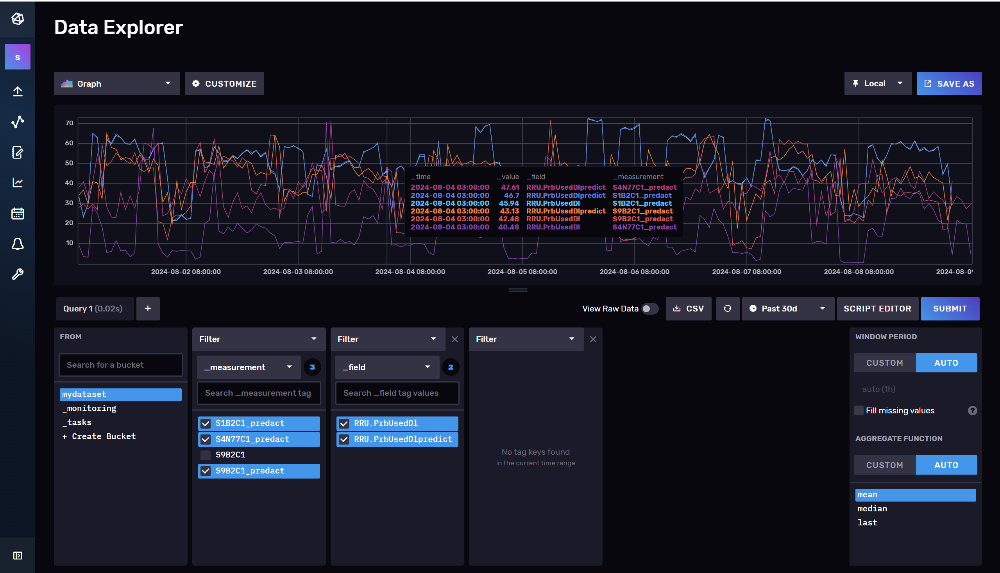
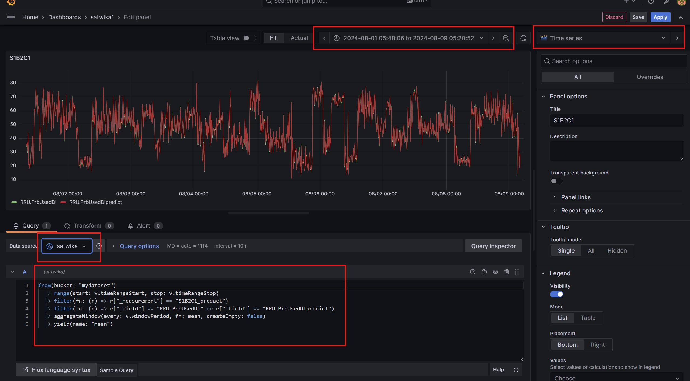
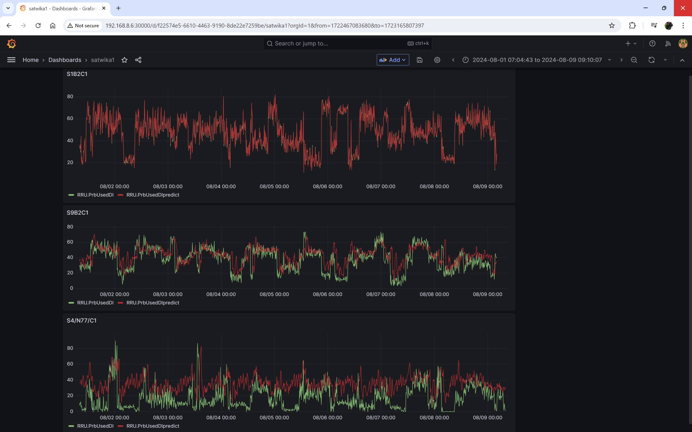

# Access Influxdb in SMO: 
```
ip: http://192.168.8.6:30001/
username: admin
password: ILYOo6TwNGyo9lUpbMczPSgldWXVhLz
```
## My Dataset Organization
```
org     : satwika
bucket  : mydataset
token   : jsTD3cFK45nep6Y2VA-MjliWCJEU8qSy1aiazoiNWxARnFBhg1xYxbh6mek8AufgUg_iHYxMRxsluOxDmEndkQ==
```
## [Click this link for tutorial upload the dataset to InfluxDB](https://github.com/bmw-ece-ntust/internship/blob/c25fbfda417eb52c6199bf893baa76008ee3cc2e/study%20notes%20onsite/Guide%20upload%20dataset/upload_dataset.md)
### this is python code for uplaod the dataset

```python
from influxdb_client import InfluxDBClient, Point
from influxdb_client.client.write_api import SYNCHRONOUS
import csv
nama_file='S1B2C1_predact'
#from datetime import datetime, timedelta
data =[]


# Parameters of InfluxDB instance
myorg = "satwika"
mybucket = "mydataset"
mytoken = "jsTD3cFK45nep6Y2VA-MjliWCJEU8qSy1aiazoiNWxARnFBhg1xYxbh6mek8AufgUg_iHYxMRxsluOxDmEndkQ=="
myurl="http://192.168.8.6:30001/"

with open('%s.csv'%nama_file, 'r') as csvfile:
      reader = csv.reader(csvfile, delimiter=',')
      next(reader)
      for row in reader:
            new_row = [float(item) for item in row[1:]]
            data.append(new_row)
"""
Instantiate write api
"""
import datetime
# Instantiate the client
client = InfluxDBClient(url=myurl,token=mytoken,org=myorg)

# Instantiate a write client using the client object
write_api = client.write_api(write_options=SYNCHRONOUS)
from datetime import datetime, timedelta

start_time = datetime.strptime("2024-08-01T00:00:00.000Z", "%Y-%m-%dT%H:%M:%S.%fZ")
for i in range(0, len(data)):
    # Data (Point structure)
    _point = Point("%s"%nama_file)\
        .field("RRU.PrbUsedDlpredict", data[i][0])\
        .field("RRU.PrbUsedDl", data[i][1])\
        .time(start_time + timedelta(minutes=i))
        
    # Write the data to InfluxDB
    write_api.write(bucket=mybucket, record=[_point])
print("Finish")
```


#  Access grafana:
```
ip: http://192.168.8.6:30000
username: admin
password: smo
```
## 1. After login, go to Administration  →  add new data source. This is configuration that should be changed:
```
1. change query language to Flux
2. URL Influxdb
3. Turn off Basic Auth
4. Organization name in influxdb
5. Token 
6. Bucket
```
**click Save and test**

## 2. Go to dashboard, and create new dashboard. This is configuration that should be changed:
```
1. Data source
2. copy script editor from influxdb
3. Change plot graph into time series
4. Change  graph's display date to match the dates in the InfluxDB dataset.
```
**Click apply and save**

### You can add more than 1 graph in Grafana
