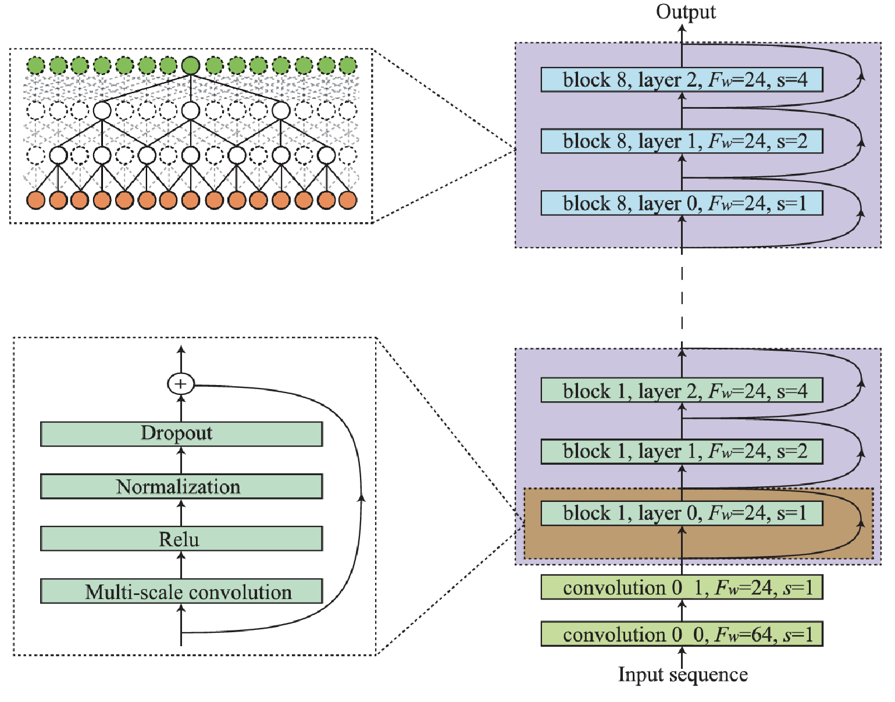
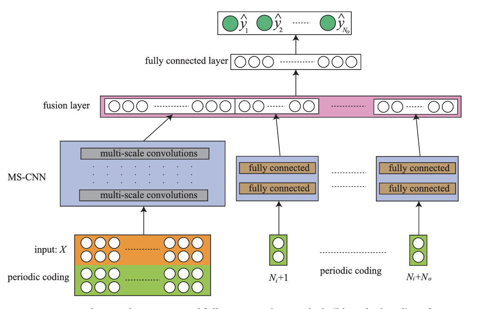

# Multi-Scale Convolutional Neural Network With Time-Cognition for Multi-Step Short-Term Load Forecasting
| **item** | information |
| --- | --- |
| **Authors** |ZHUOFU DENG|
| **Date of Publication** | July 2019|
|**type** |IEEE Access|
| **total pages** |  12 pages|
| **keywords** | Short-term load forecasting, probabilistic load forecasting, multi-step, multi-scale convolution, time cognition, deep learning.|

## Multi-scale (MS-CNN)
  
  1. Initial Convolution 
       - first layer using 64 filter
       - second layer using 24 filter
       - without any dilation (dilation rates =1) or residual connection
  2. Multi-Scale Convolutional total 8 blocks. each block contain:  
   I. first layer using 24 filters and dilation rates=1 
   II. second layer using 24 filters and dilation rates = 2  
   III. third layer using 24 filters and dilation rates = 4 
   3. each convolutional layer contain residual connection
      - The output of each convolutional layer is added to the input of the next layer (residual connection), ensuring that the network can learn both the raw features and the transformed features.
      - Each convolutional layer in a block is followed by batch normalization, ReLU activation, and dropout for regularization.

## Periodic Coding

$$ \text{period}^{sin}= \sin \frac{2\pi n}{T}$$

$$ \text{period}^{cos}= \cos\frac{2\pi n}{T}$$

## TCMS-CNN Multi-step Architecture

1. Input X:   data sequences contain historical load, hours of a aday, days of a week days of year, holiday.
2. Periodic Coding:    Periodic coding transforms cyclical time-related features into sine and cosine values, allowing the neural network to better capture periodic patterns in the data. Periodic coding is applied to both the input timestamps and the future step timestamps.
3. MS-CNN Sub-Network:    The multi-scale convolutions use different dilation rates to capture patterns at different levels of granularity
4. Fully Connected Sub-Networks:   These sub-networks take periodic coding of the predicted steps as inputs.This helps in learning the dependencies between the input data and the future load predictions
5. Fusion Layer:  The outputs from the MS-CNN sub-network and the fully connected sub-networks are concatenated in the fusion layer